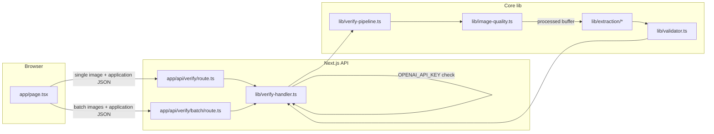
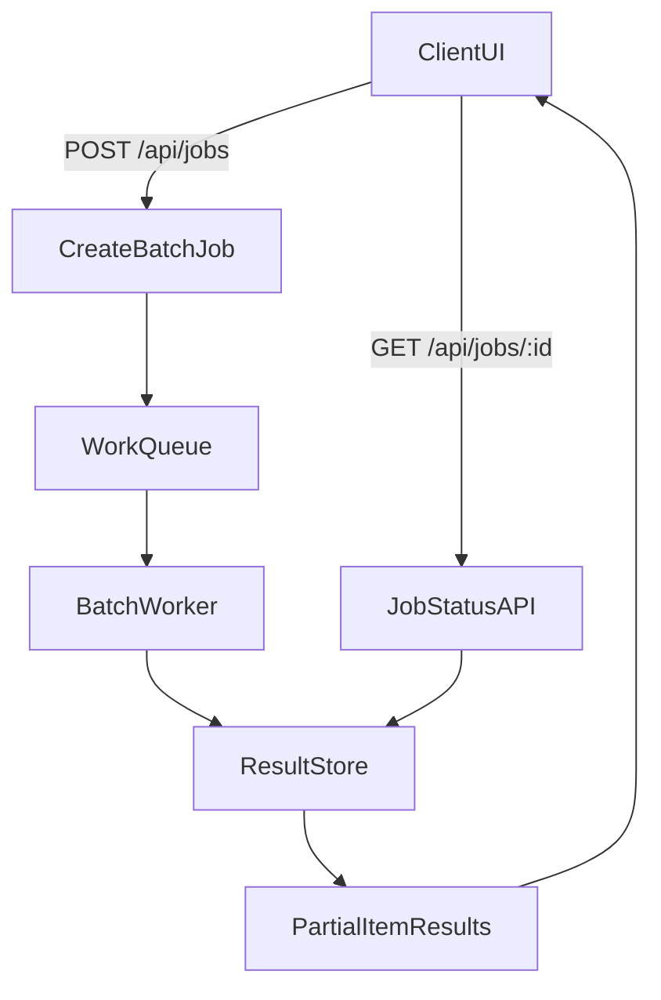

# Architecture overview (living document)

**Purpose:** High-level **system** view: how pieces connect, current phase snapshot, and where to find detail. **Per-module** behavior, decisions, and contracts live in **`docs/modules/`** — update the relevant file there when you change that code (see [`docs/modules/README.md`](./modules/README.md) index).

**Companion docs:** **Requirements vs code (evaluators):** [`docs/REQUIREMENTS_SOURCE_OF_TRUTH.md`](./REQUIREMENTS_SOURCE_OF_TRUTH.md). **Scorecard:** [`docs/CORE_REQUIREMENTS_SCORECARD.md`](./CORE_REQUIREMENTS_SCORECARD.md). **Evaluator diagram:** [`docs/ARCHITECTURE_DIAGRAM.md`](./ARCHITECTURE_DIAGRAM.md). **Eval artifacts:** [`docs/evals/README.md`](./evals/README.md). **Live prototype (Railway):** [https://ttb-alcohol-label-verifier-production.up.railway.app](https://ttb-alcohol-label-verifier-production.up.railway.app).

---

## Current product state (snapshot)

| Area | State |
|------|--------|
| **Vertical** | Distilled-spirits-oriented fields first; wine/beer deferred for this prototype scope. |
| **Pipeline** | image quality → hybrid extraction (OCR first, LLM fallback) → deterministic validation. Details: [`docs/modules/verify-pipeline.md`](./modules/verify-pipeline.md). |
| **Fallback OCR** | Implemented via `tesseract.js` in hybrid mode, with `unavailable` placeholder only as last resort if OCR/LLM both fail. See [`docs/modules/extraction.md`](./modules/extraction.md). |
| **UI** | Single client page with single-label verify (`POST /api/verify`) and MVP batch verify (`POST /api/verify/batch`). Layout and spot-check UX: [`docs/modules/app-page.md`](./modules/app-page.md). |
| **Requirements traceability** | Not CFR/COLA — see [`REQUIREMENTS_SOURCE_OF_TRUTH.md`](./REQUIREMENTS_SOURCE_OF_TRUTH.md); deterministic checks in [`validator.md`](./modules/validator.md) (`lib/validator.ts`). |
| **Persistence** | None; in-memory per request. |
| **Container** | `Dockerfile` (Next **standalone**); `npm run docker:build`. Built and run on **Railway** for the public prototype. |
| **Fixtures / eval** | `fixtures/manifest.json`; canonical production evidence via `npm run eval:fixture-verify:prod` (see `docs/evals/README.md`). |
| **Public deploy** | **Railway (live URL)** — see [`README.md`](../README.md) deployment section; set **`OPENAI_API_KEY`** on the service for working verify endpoints (`POST /api/verify`, `POST /api/verify/batch`). |

---

## End-to-end request flow

1. **UI** — [`app-page.md`](./modules/app-page.md)
2. **Handler** — [`verify-handler.md`](./modules/verify-handler.md)
3. **Pipeline** — [`verify-pipeline.md`](./modules/verify-pipeline.md)
4. **Schemas** — [`schemas.md`](./modules/schemas.md)

---

## Module index

Full table of code paths → docs: **[`docs/modules/README.md`](./modules/README.md)**.

---

## Cross-cutting decisions (summary)

| Theme | Detail |
|-------|--------|
| Thin routes / deep `lib/` | API route delegates; pipeline testable without Next (`verify-pipeline`, `verify-handler`). |
| Zod at boundaries | Schemas module + parses in handler, OpenAI provider, pipeline assembly. |
| Human review over guessing | Validator confidence floor and `manual_review` paths — [`validator.md`](./modules/validator.md). |

Further rationale lives next to the code in each **module doc**.

---

## Phase 2: async batch jobs (planned)

Current MVP batch (`POST /api/verify/batch`) processes images **synchronously** in the request with bounded concurrency and returns a full per-item payload when complete. Phase 2 adds durable job orchestration for larger operational batches:

| Step | Behavior |
|------|----------|
| **Job create** | Client uploads manifest + application JSON; server returns `jobId`, accepted file count, and limits. |
| **Poll status** | `GET /api/jobs/:id` returns `queued`, `running`, `partial`, `completed`, or `failed` with progress counts. |
| **Partial completion** | Completed items appear incrementally (`items[]` with `durationMs`, `error.message`, validation summary) while work continues. |
| **Terminal states** | `completed` (all items processed), `failed` (unrecoverable job error), `cancelled` (optional operator abort). |

Until Phase 2 ships, the UI documents synchronous limits (max files, per-file size, expected runtime) and surfaces per-item timing and failure reasons in the batch results table.

---

## Environment and operations

- **Local / deploy / secrets:** `README.md`, `.env.example`
- **Next + Sharp bundling:** [`next-config.md`](./modules/next-config.md)

---

## Maintenance checklist

- [ ] **New or renamed code unit** → add or update a row in [`docs/modules/README.md`](./modules/README.md) and create/retitle the matching `docs/modules/*.md`.
- [ ] **Flow or phase snapshot change** → update **Current product state** and Mermaid diagram in this file if needed.
- [ ] **New Vitest file** → add a row under **Vitest map** in [`docs/modules/README.md`](./modules/README.md).
- [ ] **AGENTS.md** — agents should update the **module doc** that owns the change (not only this overview).

---

*Overview aligned with Phase 1 pipeline, module docs under `docs/modules/`, and UI spot-check layout documented on [`app-page.md`](./modules/app-page.md).*
