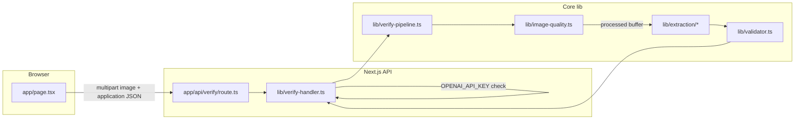

# Architecture overview (living document)

**Purpose:** High-level **system** view: how pieces connect, current phase snapshot, and where to find detail. **Per-module** behavior, decisions, and contracts live in **`docs/modules/`** — update the relevant file there when you change that code (see [`docs/modules/README.md`](./modules/README.md) index).

**Companion docs:** Short status (done / next / blockers): [`docs/PROGRESS.md`](./PROGRESS.md). Product scope and phases: `docs/PRD.md`, `docs/IMPLEMENTATION_PLAN.md`.

---

## Current product state (snapshot)

| Area | State |
|------|--------|
| **Vertical** | Distilled-spirits-oriented fields first; wine/beer deferred per PRD. |
| **Pipeline** | Phase 1: image quality → OpenAI vision (`gpt-4o-mini`) → deterministic validation. Details: [`docs/modules/verify-pipeline.md`](./modules/verify-pipeline.md). |
| **Fallback OCR** | Not implemented; placeholder provider. See [`docs/modules/extraction.md`](./modules/extraction.md). |
| **UI** | Single client page → `POST /api/verify`. Layout and spot-check UX: [`docs/modules/app-page.md`](./modules/app-page.md). |
| **Persistence** | None; in-memory per request. |

---

## End-to-end request flow

1. **UI** — [`app-page.md`](./modules/app-page.md)
2. **Handler** — [`verify-handler.md`](./modules/verify-handler.md)
3. **Pipeline** — [`verify-pipeline.md`](./modules/verify-pipeline.md)
4. **Schemas** — [`schemas.md`](./modules/schemas.md)

---

## Module index

Full table of code paths → docs: **[`docs/modules/README.md`](./modules/README.md)**.

---

## Cross-cutting decisions (summary)

| Theme | Detail |
|-------|--------|
| Thin routes / deep `lib/` | API route delegates; pipeline testable without Next (`verify-pipeline`, `verify-handler`). |
| Zod at boundaries | Schemas module + parses in handler, OpenAI provider, pipeline assembly. |
| Human review over guessing | Validator confidence floor and `manual_review` paths — [`validator.md`](./modules/validator.md). |

Further rationale lives next to the code in each **module doc**.

---

## Environment and operations

- **Local / deploy / secrets:** `README.md`, `.env.example`
- **Next + Sharp bundling:** [`next-config.md`](./modules/next-config.md)

---

## Maintenance checklist

- [ ] **New or renamed code unit** → add or update a row in [`docs/modules/README.md`](./modules/README.md) and create/retitle the matching `docs/modules/*.md`.
- [ ] **Flow or phase snapshot change** → update **Current product state** and Mermaid diagram in this file if needed.
- [ ] **New Vitest file** → add a row under **Vitest map** in [`docs/modules/README.md`](./modules/README.md).
- [ ] **AGENTS.md** — agents should update the **module doc** that owns the change (not only this overview).

---

*Overview aligned with Phase 1 pipeline, module docs under `docs/modules/`, and UI spot-check layout documented on [`app-page.md`](./modules/app-page.md).*
