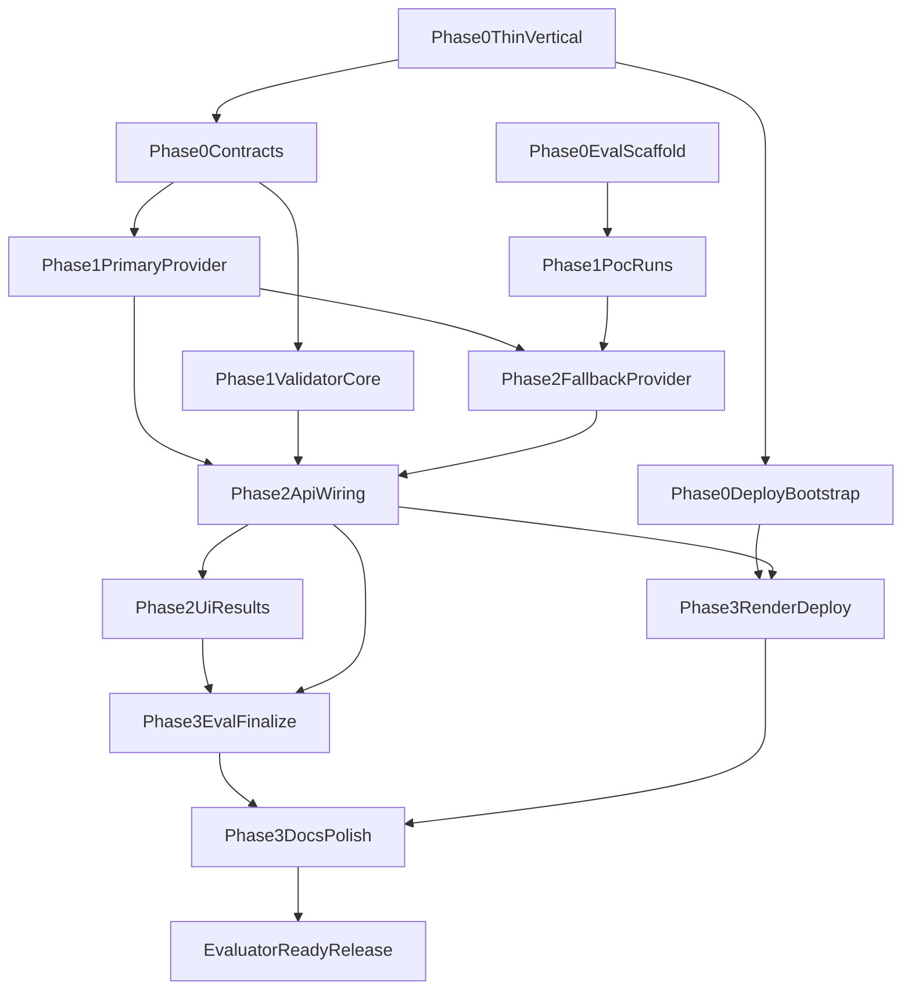

# Implementation Plan and Technical Specification

**Project:** TTB Alcohol Label Verification Take-Home  
**Purpose:** Build-facing source of truth: contracts, phases, workstreams, evals, and acceptance criteria. Product intent remains in `docs/PRD.md`; research rationale in `docs/PRESEARCH.md`.

**Canonical umbrella (start here):** [`docs/COMPREHENSIVE_IMPLEMENTATION_PLAN.md`](./COMPREHENSIVE_IMPLEMENTATION_PLAN.md) — single merged plan: as-built summary, phase status, eval strategy, remaining work, acceptance.

**Related:** `docs/DAY1_EXECUTION_CHECKLIST.md`, `docs/DAY2_EXECUTION_CHECKLIST.md`, `docs/DAY3_EXECUTION_CHECKLIST.md`, `docs/WEEK_EXECUTION_OVERVIEW.md`, `AGENTS.md`, `docs/SOFTWARE_DESIGN_PRINCIPLES.md`, `docs/REPOSITORY_HYGIENE.md`.

---

## 1. Scope lock

- **Vertical rollout:** distilled spirits first, wine second, beer third.
- **MVP fields:** brand name, class/type, alcohol content (ABV/proof), net contents, government warning (aligned with take-home sample).
- **P1 fields:** name/address (`F-17`), country of origin for imports (`F-18`); LLM primary + manual review on fallback/low confidence; `countryOfOrigin` is `not_applicable` when application marks non-import.
- **Out of scope:** COLA/SSO, persistence, full 27 CFR automation, spatial heuristics on fallback, plugin/rule-engine frameworks (see §14).

---

## 2. Locked decisions

### 2.1 Deployment

- **Shipped prototype (2026-05-11):** Dockerized service on **Railway** — [https://ttb-alcohol-label-verifier-production.up.railway.app](https://ttb-alcohol-label-verifier-production.up.railway.app) — from root **`Dockerfile`** (Next standalone; Tesseract **not** in image until Phase 2).
- **Original default / alternate:** **Render** (same Dockerfile); see `docs/RENDER_DEPLOY.md` if Render blocks ship on Railway or you want a second host.
- **Other fallback platforms:** Fly.io or Hugging Face Spaces (Docker mode).
- **Secrets:** `OPENAI_API_KEY` via platform env; never committed. **Production eval:** timeline **`docs/evals/PRIMARY_LATENCY_RUNS.md`**; latest snapshot e.g. **`docs/evals/primary-latency-production-2026-05-12.json`** — **200** with **`openai`** on three fixtures (default **8000 / 20000** ms extract budgets; key on Railway).

### 2.2 Fallback OCR

- **Default:** Tesseract.js + regex on concatenated OCR text for structured fields only.
- **Go/no-go (POC-1):** keep Tesseract only if:
  - image/build acceptable on chosen tier,
  - Tesseract inference **P95 ≤ ~1.5s** after hard-timeout window on **≥10** fixture labels,
  - structured-field extraction (warning, ABV, net contents) **≥80% field-level accuracy** on that set.
- **Pivot order** (same `ExtractionProvider` interface): (1) worker-thread / tuning, (2) ONNX Runtime Node path, (3) PaddleOCR sidecar/service.

### 2.3 Failover timing

- **Soft timeout:** 3.0s — start fallback **in parallel** with primary.
- **Hard timeout:** 3.5s — cancel primary, return fallback result if available.

**As-shipped note (2026-05-12):** runtime defaults in `lib/verify-pipeline.ts` / `lib/extraction/provider.ts` are **8000 ms / 20000 ms** so typical OpenAI vision completes on deployed hosts; override with `VERIFY_EXTRACT_*`. Treat the 3.0s / 3.5s bullets above as the **original PRD budget narrative**, not the live default. Authoritative merge: [`COMPREHENSIVE_IMPLEMENTATION_PLAN.md`](./COMPREHENSIVE_IMPLEMENTATION_PLAN.md) §3.2.

---

## 3. Technical contracts

### 3.1 HTTP: `POST /api/verify`

**Content-Type:** `multipart/form-data`

| Part | Required | Description |
|------|----------|-------------|
| `image` | Yes | JPEG or PNG label image |
| `application` | Yes | JSON string: submitted application fields for comparison |

**Optional headers / form fields (P1):**

- `force_fallback` or env `USE_LOCAL_OCR=1` — route through local OCR provider only (eval/demo).

**Application JSON (minimum contract):**

```json
{
  "productClass": "distilled_spirits",
  "isImport": false,
  "brandName": "string",
  "classType": "string",
  "alcoholContent": "string",
  "netContents": "string",
  "governmentWarning": "string",
  "nameAddress": "string",
  "countryOfOrigin": "string"
}
```

- `isImport`: when `false`, validator marks `countryOfOrigin` as **`not_applicable`** (not fail).
- Omitted optional keys: treat as empty or `not_applicable` per field rules in §5.

**Response JSON (success):**

```json
{
  "requestId": "uuid",
  "imageQuality": { "ok": true },
  "extraction": {
    "provider": "openai",
    "durationMs": 0,
    "fields": {}
  },
  "validation": {
    "fields": []
  }
}
```

Each **field result** in `validation.fields`:

| Property | Type | Description |
|----------|------|-------------|
| `fieldId` | string | Stable id: `brandName`, `classType`, `alcoholContent`, `netContents`, `governmentWarning`, `nameAddress`, `countryOfOrigin` |
| `status` | enum | `pass` \| `fail` \| `manual_review` \| `not_applicable` |
| `message` | string | Human-readable rationale |
| `extractedValue` | string \| null | Raw extracted text when present |
| `applicationValue` | string \| null | From submitted JSON |
| `evidence` | string \| null | Optional snippet for reviewers |

**Error responses:** stable shape `{ "requestId", "code", "message", "details?" }`; HTTP 4xx for client errors, 5xx for server/provider failures.

### 3.2 Internal schemas (`lib/schemas.ts`)

- Single Zod source for multipart parse output, extraction result, and validation result.
- Validate LLM JSON at boundary; reject malformed model output with controlled error or manual_review umbrella.

### 3.3 `ExtractionProvider` contract (`lib/extraction/provider.ts`)

```typescript
export interface ExtractionProvider {
  extract(imageBytes: Buffer, signal?: AbortSignal): Promise<ExtractionResult>;
}

export async function extractWithFailover(
  imageBytes: Buffer,
  primary: ExtractionProvider,
  fallback: ExtractionProvider,
  opts?: { softTimeoutMs?: number; hardTimeoutMs?: number },
): Promise<ExtractionResult>;
```

- **Only** `extractWithFailover` implements soft/hard timeout and parallel fallback start.
- `ExtractionResult` includes `provider: "openai" | "tesseract" | ...`, per-field `value`, `confidence` (0–1 or low/med/high), optional `reason`.

### 3.4 Validator contract (`lib/validator.ts`)

- **Pure:** no I/O, no network.
- **Inputs:** normalized `ExtractionResult` + parsed application object + canonical warning text reference.
- **Outputs:** array of field validation rows (§3.1).

---

## 4. Field-handling matrix

| Field | Primary (LLM) | Fallback (Tesseract + regex) | Comparison rule |
|-------|-----------------|--------------------------------|-------------------|
| brandName | Extract + confidence | `null` → **manual_review** | F-7 fuzzy normalized + Levenshtein threshold |
| classType | Extract + confidence | `null` → **manual_review** | Deterministic match strategy (normalize + similarity or exact per PRD intent) |
| alcoholContent | Extract + confidence | Regex on OCR text | Regex/normalize ABV & proof; fail on meaningful deviation |
| netContents | Extract + confidence | Regex on OCR text | Normalize units; compare semantic equivalence |
| governmentWarning | Extract + confidence | Regex anchored `GOVERNMENT WARNING` | F-8 exact case-sensitive vs canonical |
| nameAddress | Extract + confidence | `null` → **manual_review** | Compare when extracted; low confidence → manual_review |
| countryOfOrigin | Extract + confidence | `null` → **manual_review** | If `!isImport` → **not_applicable**; else compare or manual_review |

---

## 5. PRD requirement mapping

| ID | Implementation behavior |
|----|-------------------------|
| F-1 | UI + `app/api/verify` multipart handler |
| F-2 | Extraction schema + OpenAI + fallback regex fields |
| F-3 | `openai-provider.ts`: vision + structured JSON + low-confidence instructions |
| F-4 | `tesseract-provider.ts` + regex; Tesseract-first + POC-1 pivot policy |
| F-5 | `extractWithFailover`: parallel soft/hard timeouts (**shipped defaults 8000 ms / 20000 ms** in `verify-pipeline`; original PRD narrative 3.0s / 3.5s — see §2.3 note) |
| F-6 | `validator.ts` per-field compare |
| F-7 | Brand normalization + Levenshtein in `validator.ts` |
| F-8 | Strict warning match in `validator.ts` |
| F-9 | UI results table + provider + evidence |
| F-10 | Instrumented tests + deployed validation against §7 budget |
| F-11 | `lib/image-quality.ts` pre-check |
| F-12 | Render deploy + public URL |
| F-13 | README + repo |
| F-14 | Batch UI + loop or batch route |
| F-15 | Surface `confidence` in UI |
| F-16 | Env + UI toggle → orchestrator |
| F-17 | Schema + LLM field + validator + manual_review path |
| F-18 | `isImport` conditional + validator `not_applicable` |

---

## 6. Module boundaries (code quality)

- **`app/api/*`:** parse, call image-quality → orchestrator → validator, map errors; no business comparison logic.
- **`lib/extraction/*`:** providers + failover only.
- **`lib/validator.ts`:** deterministic rules only.
- **`lib/schemas.ts`:** shared types.
- **UI:** no provider branching beyond displaying `provider` string and statuses.

---

## 7. Phases and exit gates

### Phase 0 — Foundations

- Thin vertical skeleton: stub `POST /api/verify`, minimal upload UI, smoke test.
- Lock Zod schemas for request/response.
- **Exit:** E2E stub green; lint/type/test baseline green.

### Phase 1 — Core engine (distilled-first)

- OpenAI provider + validator core + tests (Dave/Jenny cases).
- POC-1 / POC-2 runs; record fallback go/no-go.
- **Exit:** Primary path returns real extraction + validation for MVP fields.

### Phase 2 — Fallback + UX

- Tesseract provider + failover integration + F-16 path.
- Results UI wired to live API.
- **Exit:** Failover demonstrable; statuses correct.

### Phase 3 — Quality, evals, deploy

- Eval summary in README; Render production smoke; batch/confidence if time.
- **Exit:** Public URL + evaluator checklist complete.

---

## 8. Workstreams (parallel lanes)

| WS | Scope |
|----|--------|
| WS-A | API routes, multipart, error contracts |
| WS-B | Providers + `extractWithFailover` |
| WS-C | Validator + unit tests |
| WS-D | Upload UI + results table |
| WS-E | Fixtures, eval scripts, metrics |
| WS-F | Dockerfile, Render, secrets |

**Parallelization:** After Phase 0 schema lock, WS-C can use mocked extraction; WS-D can use mocked API responses; WS-F parallels core dev.

---

## 9. Execution DAG



---

## 10. Eval plan

### 10.1 Fixtures

- ≥10 distilled-spirit-style synthetic labels (clean + glare/skew subset).
- Ground-truth JSON per image under `tests/fixtures/`.

### 10.2 Validator tests (required)

- Warning: exact pass; casing/wording fail.
- Brand: punctuation/case normalization (e.g. STONE'S THROW vs Stone's Throw).
- Import flag: `countryOfOrigin` not_applicable vs compare.

### 10.3 Extraction / integration

- Mocked provider contract tests.
- Optional live OpenAI smoke (skipped in CI without key).

### 10.4 Latency

- Log `durationMs` per request; sample P50/P95 on primary and simulated failover.

### 10.5 Acceptance thresholds (minimum)

| Metric | Target |
|--------|--------|
| Warning strict checks | 100% on constructed cases |
| Primary extraction (stylized set) | ≥80% field-level with low-confidence on failures (POC-2) |
| Fallback structured fields (POC-1) | ≥80% on fixtures; P95 latency within budget |
| E2E P95 | &lt; 5s primary and failover paths per PRD §7 |

---

## 11. TDD policy (phase gates)

**Test-first:**

- `validator.ts` (warning, brand, conditionals).
- `extractWithFailover` timeout behavior (`timeout-behavior.test.ts`).
- Provider interface contract (`provider-contract.test.ts`).

**Implementation-first allowed** with immediate tests:

- Multipart wiring, UI layout, deployment config.

**Gate:** No phase advance until listed tests for that phase are green.

---

## 12. Error handling and logging (prototype)

- Structured logs: `requestId`, stage, `provider`, durations, field statuses (no raw secrets).
- User-facing messages: safe and actionable; internal detail in logs.

---

## 13. Risks and cut-lines

**Cut order if slipping:**

1. F-14/F-15 polish.
2. F-17/F-18 depth (keep manual_review stubs).
3. Non-critical UI styling.

**Do not cut:** F-1–F-13 core path, failover tests, warning strictness, schema clarity.

---

## 14. Anti-overengineering guardrails

**Build now:** single-container Next app, Zod, Vitest, explicit modules.

**Defer:** separate microservices, DB, queues, dynamic rule engines, full spatial layout compliance.

**Before new abstraction:** needed for current scope? simplifies code now? testable within timeline? If any “no,” defer.

---

## 15. Canonical file layout (target)

```
ttb-alcohol-label-verifier/
├── app/
│   ├── api/verify/route.ts
│   └── (pages / UI)
├── lib/
│   ├── extraction/
│   │   ├── provider.ts
│   │   ├── openai-provider.ts
│   │   └── tesseract-provider.ts
│   ├── validator.ts
│   ├── image-quality.ts
│   └── schemas.ts
├── tests/
│   ├── validator.test.ts
│   ├── provider-contract.test.ts
│   ├── timeout-behavior.test.ts
│   └── fixtures/
├── Dockerfile
├── package.json
└── README.md
```

---

## 16. Acceptance checklist (this deliverable)

- [ ] Engineer can implement without reopening PRD for ambiguity on contracts and statuses.
- [ ] Every PRD F-* maps to code ownership (§5).
- [ ] Eval methods and thresholds are explicit (§10).
- [ ] Manual-review paths documented per field (§4).
- [ ] Deployment and fallback policies consistent with README and PRESEARCH.

### Day 3 notes (2026-05-11)

- **Public URL + docs:** `README.md`, `docs/PROGRESS.md`, `docs/ARCHITECTURE.md`, `docs/DAY3_EXECUTION_CHECKLIST.md` updated for **Railway** deploy; **Render** runbook retained.
- **Production eval artifacts:** [`docs/evals/PRIMARY_LATENCY_RUNS.md`](./evals/PRIMARY_LATENCY_RUNS.md) (timeline); e.g. [`primary-latency-production-2026-05-12.json`](./evals/primary-latency-production-2026-05-12.json) — **200** + ~3.5–6.5s round trips; **`openai`** on three fixtures; default **`VERIFY_EXTRACT_*`** **8000 / 20000** ms in app code.

*End of implementation plan.*
