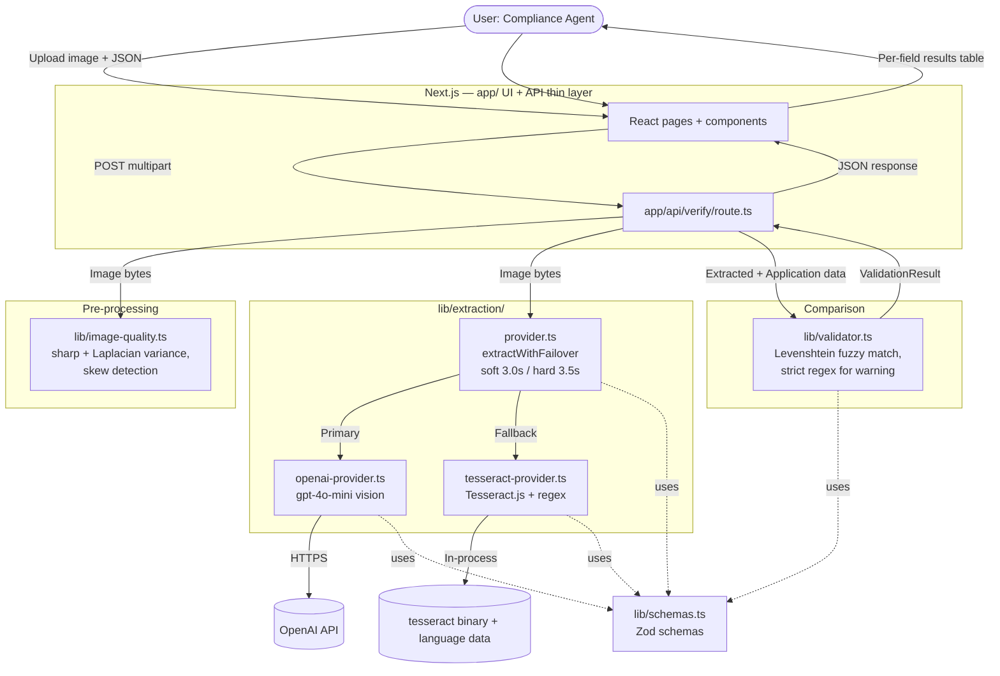

# Technical Presearch: TTB Alcohol Label Verification Prototype

**Project:** TTB AI-Powered Alcohol Label Verification — Take-Home
**Author:** [Candidate]
**Status:** Draft
**Last updated:** May 10, 2026

---

## 1. Requirements summary

Pulled from the PRD and ranked by how much they constrain technology choice.

**Hard constraints — these eliminate options.**

- **Sub-five-second P95 latency, single label.** Sarah's prior-vendor failure was at 30–40s. Any extraction approach with unpredictable tail latency is out. The budget must hold under failover, not just on the happy path.
- **Must operate behind Treasury's network egress restrictions for the production version.** Marcus's firewall comment is the reason the architecture has a local-OCR fallback at all. Any technology choice that requires runtime cloud calls with no offline path fails this.
- **Government warning comparison must be exact, case-sensitive.** Jenny's example. This is a deterministic algorithm requirement, not an AI requirement.
- **One-week build window, solo developer.** Rules out anything that requires significant infrastructure setup or unfamiliar tooling.

**Soft constraints — these shape choice.**

- **"AI-powered" in the project title.** Title implies a meaningful AI component; deterministic-only would underdeliver on stated framing.
- **Imperfect images expected.** Jenny named glare, angles, foil, stylization. Any extraction technology with poor performance on these is a problem.
- **Batch handling for 200–300 label peaks.** Sarah and Janet both raised it.
- **UI for a wide range of tech comfort.** Sarah's "my mother could figure out" benchmark.
- **Take-home asks for common cross-beverage fields beyond the MVP core.** Name/address and country of origin (for imports) should be planned, even if staged after core checks.
- **Vertical rollout order matters for scope control.** Build distilled spirits first (most complex sample and rule shape), then wine (expected volume), then beer.

**Things that do not apply at this scope.**

- Data model complexity, query patterns, scale projections (no persistence in the prototype; no database).
- Authentication, multi-tenancy, RBAC (out of scope).
- Compliance posture for the prototype itself (synthetic data, public deployment, no PII).
- Team expertise (one person; pick what they can ship in a week).

---

## 2. Decision points

Categorized per the framework.

| Decision | Category | Notes |
|---|---|---|
| Application language (full-stack) | **Chosen: TypeScript** | One language for HTTP API, orchestration, validation, and tests. Node runtime required for server-side OCR and OpenAI SDK. |
| Web UI + API | **Chosen: Next.js (App Router)** | React UI + Route Handlers; Zod at the boundary. Trade-off vs Gradio: more setup, stronger web UX and typing story. |
| Primary extraction (cloud LLM) | Needs evaluation | Real choice between OpenAI, Google Gemini, and self-hosted alternatives. Vendor selection has political dimension. |
| Fallback extraction (local OCR in Node) | **Implementation choice** | Python ecosystem favors PaddleOCR PP-OCRv5; **Node** prototype uses **Tesseract.js** first (no Python subprocess). ONNX Runtime Node optional if POC-1 fails latency/accuracy. |
| Failover orchestration | **Needs design** | Naive cascading would breach the latency budget. Soft/hard timeout pattern documented in §4. |
| Field-comparison logic | Obvious | Levenshtein + regex (e.g. `fast-levenshtein` / `fuzzball`). Deterministic, fast, testable. |
| Image quality pre-check | Obvious | `sharp` decode + Laplacian variance in TS. Standard, deterministic. |
| Containerization | Obvious | Docker. Required for HF Spaces beyond trivial apps; required for portability. |
| Deployment target | **Chosen: Render (Docker)** | Lowest-friction path to a stable public HTTPS URL for evaluator testing. Fly.io or HF Docker mode are fallbacks if platform limits block shipping. |
| Database / persistence | Not applicable | None. The PRD non-goals are explicit. |
| Authentication / auth | Not applicable | None. Public prototype, synthetic data. |

---

## 3. Architecture options considered

Three architectures were on the table. Documenting the alternatives so the chosen one is defensible against challenge.

**Option A — Pure cloud LLM extraction.**
Single call to a vision LLM, receive structured JSON, deterministic comparison. Simplest. But: no firewall story, no resilience to API outage during reviewer's demo, vendor lock-in unclear.

**Option B — Pure local OCR + heuristic field ID.**
EasyOCR or PaddleOCR extracts text; regex and position heuristics identify which text is which field; deterministic comparison. Robust to firewall, no API costs. But: harder to defend "AI-powered" framing without explaining that modern OCR is deep learning; spatial heuristics for field ID are brittle research-grade work; weak story on stylized labels.

**Option C — Cloud LLM primary + local OCR fallback (selected).**
Primary path uses cloud LLM for combined extraction-plus-field-identification in one call; local OCR fallback exists behind the same interface for resilience and to demonstrate firewall-survivability. Higher build cost; better story across every rubric criterion.

Detail below.

---

## 4. Chosen architecture

This section documents the architecture chosen in the PRD with enough detail that every requirement maps to a component, and every failure mode maps to a mitigation. It is the bridge between the PRD's "what and why" and the code.

### 4.1 Component diagram



The boundaries that matter:

- **`app/` UI and verify Route Handler are intentionally thin.** They parse multipart input, call orchestration + validator, return JSON. No comparison logic in React. This keeps validation and extraction independently testable.
- **`lib/extraction/provider.ts` is the only place timeout orchestration lives.** Both providers implement the same interface; the orchestrator owns failover policy. This is what makes the dual-path story testable as a single concern.
- **`lib/validator.ts` is pure.** No I/O, no network, no model dependencies. Takes structured input, returns structured output. This is where the unit tests for Dave's and Jenny's edge cases live.

### 4.2 Request flow — happy path (primary returns successfully)

```mermaid
sequenceDiagram
    participant U as User
    participant W as Next.js UI
    participant R as API route
    participant Q as image-quality
    participant O as extraction orchestrator
    participant P as OpenAI provider
    participant API as OpenAI API
    participant V as validator

    U->>W: Upload image + application JSON
    W->>R: POST multipart
    R->>Q: checkQuality(imageBytes)
    Q-->>R: ok=true
    R->>O: extractWithFailover(imageBytes)
    O->>P: extract(imageBytes) [start primary]
    P->>API: chat.completions.create (vision, JSON mode)
    API-->>P: structured JSON response (1.5–3.0s)
    P-->>O: ExtractionResult(provider="openai")
    O-->>R: ExtractionResult
    R->>V: compare(extracted, application)
    V-->>R: ValidationResult (per-field pass/fail/manual)
    R-->>W: JSON results
    W-->>U: Render results table

    Note over U,V: P95 total ≈ 3.5s; ~1.5s headroom inside 5s budget
```

### 4.3 Request flow — failover path (primary hangs)

```mermaid
sequenceDiagram
    participant U as User
    participant W as Next.js UI
    participant R as API route
    participant O as extraction orchestrator
    participant P as OpenAI provider
    participant F as Tesseract provider
    participant V as validator

    U->>W: Upload image + application JSON
    W->>R: POST multipart
    R->>O: extractWithFailover(imageBytes)
    O->>P: extract(imageBytes) [primary task]
    Note over P: API hangs / network issue
    Note over O: 3.0s — soft timeout
    O->>F: extract(imageBytes) [parallel fallback task]
    Note over O: 3.5s — hard timeout
    O--xP: cancel primary
    F-->>O: ExtractionResult(provider="tesseract")
    Note over F: structured fields via regex;<br/>brand & class/type = unavailable
    O-->>R: ExtractionResult (failover)
    R->>V: compare(extracted, application)
    V-->>R: ValidationResult (brand/class flagged manual)
    R-->>W: JSON results
    W-->>U: Results table with provider="fallback"

    Note over U,V: P95 total ≈ 4.7s; tight but inside budget
```

The parallel-start at the soft timeout is what makes the failover budget work. If the orchestrator waited for the hard timeout *before* starting the fallback, total time would be ~6 seconds — outside budget. This is the single most important architectural detail for hitting the latency requirement under degraded conditions.

### 4.4 The `ExtractionProvider` contract

The contract that makes the dual-path story real. Both providers implement this interface; the orchestrator only depends on the type.

```typescript
// lib/extraction/provider.ts — illustrative
import { z } from "zod";
import { extractionResultSchema } from "../schemas";

export type ExtractionResult = z.infer<typeof extractionResultSchema>;

export interface ExtractionProvider {
  extract(imageBytes: Buffer): Promise<ExtractionResult>;
}

export async function extractWithFailover(
  imageBytes: Buffer,
  primary: ExtractionProvider,
  fallback: ExtractionProvider,
  softTimeoutS = 3.0,
  hardTimeoutS = 3.5,
): Promise<ExtractionResult> {
  /**
   * Run primary; if it doesn't return by softTimeoutS, start
   * fallback in parallel. If primary still hasn't returned by
   * hardTimeoutS, cancel it and return whatever fallback produced.
   * Tested in timeout-behavior.test.ts.
   */
  // ...
}
```

`ExtractionResult` is validated with **Zod** (`lib/schemas.ts`): `provider` is `"openai" | "tesseract"` (or your documented substitute). `FieldExtraction.value` may be `null` when the provider cannot reliably extract — surfaced as manual review in the UI.

### 4.5 Fallback path — what it does and doesn't do

The fallback is honestly scoped to what regex on concatenated OCR text can do reliably:

| Field | Fallback strategy |
|---|---|
| Government warning | Regex anchored on `GOVERNMENT WARNING:` literal; extract the full warning text from there. Comparison is exact. **Reliable.** |
| Alcohol content | Regex `\d+(?:\.\d+)?\s*%\s*alc(?:ohol)?(?:\s*[/.]?\s*vol)?` plus proof variant. **Reliable.** |
| Net contents | Regex matching common volume units: `\d+(?:\.\d+)?\s*(?:ml|mL|L|fl\s*oz|gal)`. **Reliable.** |
| Brand name | `value=None`, `reason="brand identification requires spatial layout context not available on this path"`. **Returns "manual review."** |
| Class/type | Same — `value=None`, manual review. |
| Name/address | `value=None`, `reason="entity/address extraction on fallback path is not reliable without layout-aware parsing"`. **Returns "manual review."** |
| Country of origin (imports) | `value=None`, `reason="origin extraction on fallback path is not reliable without stronger field identification"`. **Returns "manual review."** |

Spatial heuristics (largest text = brand, top text = class, etc.) are explicitly out of scope. They are brittle research-grade work that would consume the build window, and a fallback that *quietly* returns wrong answers is worse than one that openly says "manual review needed for this field." This narrowing is the difference between a fallback that demonstrates resilience and a fallback that creates new failure modes.

### 4.6 How requirements map to components

| PRD Requirement | Component |
|---|---|
| F-1 upload UI | `app/` (React file inputs + form) |
| F-2 field extraction | `lib/extraction/openai-provider.ts` (primary) + `lib/extraction/tesseract-provider.ts` (fallback) |
| F-3 structured-JSON LLM extraction | `openai-provider.ts` with `response_format` + Zod parse |
| F-4 fallback extraction with narrowed scope | `tesseract-provider.ts` |
| F-5 timeout-driven failover | `lib/extraction/provider.ts` :: `extractWithFailover` |
| F-6 field comparison | `lib/validator.ts` |
| F-7 fuzzy brand matching | `validator.ts` (Levenshtein library) |
| F-8 strict warning matching | `validator.ts` (regex, case-sensitive) |
| F-9 results table | React components consuming API JSON |
| F-10 latency budget | enforced by `extractWithFailover` timeouts; measured in `timeout-behavior.test.ts` |
| F-11 image quality pre-check | `lib/image-quality.ts` (sharp + Laplacian) |
| F-12 deployment | `Dockerfile` + platform (Render / Fly / HF Docker mode per PRD §11) |
| F-13 GitHub repo + README | repo structure |
| F-14 batch upload | Multi-file upload in UI + loop or batch API in Route Handler |
| F-15 confidence indicators | Zod `FieldExtraction.confidence`, surfaced in UI |
| F-16 manual provider toggle | UI control → env or request flag → orchestrator |
| F-17 name/address extraction + compare | `openai-provider.ts` (primary extraction) + `validator.ts` (comparison) + UI manual-review state when extraction confidence is low |
| F-18 country of origin for imports | `openai-provider.ts` (primary extraction) + `validator.ts` conditional rule (`not_applicable` for non-imports; compare/manual-review for imports) |

Every PRD requirement has a home. No requirement is orphaned, and no component exists without a requirement.

### 4.7 Minimal approach for added common fields

To stay within the one-week build window while aligning with take-home requirements:

- **Primary path (LLM):** extend structured extraction schema to include `nameAddress` and `countryOfOrigin` with confidence.
- **Fallback path (local OCR):** return `null` for both fields and surface **manual review**; do not add brittle regex/spatial heuristics for these fields in fallback.
- **Validation behavior:** for `countryOfOrigin`, only enforce comparison when the application indicates imported product; otherwise mark `not_applicable` rather than fail.

This keeps correctness risk low while preserving the latency budget and avoiding false confidence on fields that are harder to parse reliably without layout-aware extraction.

Vertical rollout for implementation remains: distilled spirits first, then wine, then beer.

---

## 5. Language & framework evaluation

### Full-stack: TypeScript on Node — **selected**

**Rationale:** Candidate chose **full-stack TypeScript**: shared types from API to UI, Vitest for fast tests, **OpenAI official JS SDK**, Zod for runtime validation. The trade-off is **local OCR quality**: Python would pair naturally with PaddleOCR; **Node** uses **Tesseract.js** by default (see §7).

### UI + API: Next.js (App Router) — **selected**

Evaluated against prior choices.

- **Next.js (selected).** React delivers accessible, obvious upload + results layouts; Route Handlers implement the verify endpoint without a separate FastAPI service. Fits “full-stack TS” explicitly.
- **Gradio.** Fastest path on Hugging Face Spaces; minimal JS. Superseded when the stack requirement is TypeScript end-to-end.
- **Streamlit.** Still Python-only; same mismatch with full-stack TS.

**Deployment:** Prefer **Docker** (Node + `tesseract-ocr` OS packages) on **Render** as the default host. Use **Fly.io** or **HF Spaces Docker SDK mode** as fallback platforms if needed — not the zero-config Gradio `requirements.txt` path.

Confidence: high for alignment with the PRD; medium on one-session setup complexity versus Gradio.

---

## 6. Primary extraction: vision LLM evaluation

This is the most consequential research finding. Three providers are realistic candidates, and the choice has both technical and political dimensions.

### Candidates

**OpenAI `gpt-4o-mini` (selected).**
Fast, cheap, well-documented, structured-output via `response_format`. Treasury and OPM publicly approved as of March 2026 (after Anthropic was removed). Available via Azure OpenAI Service over FedRAMP High private endpoints for the production migration story.

**Google `gemini-2.5-flash` / `gemini-2.5-pro`.**
Strong document-processing performance. 1M-token context window (irrelevant here, but indicates capability). Available via Google Cloud's FedRAMP High offering. OPM also lists Google Gemini on their approved use-cases.

**Anthropic Claude Sonnet 4.6.**
Highest accuracy in 2026 document-extraction benchmarks (97.6% per TokenMix April 2026 data) — but Treasury publicly committed to phasing out Anthropic in February 2026, and OPM removed Claude from their approved AI use-cases on March 4, 2026. Legal situation is unresolved (preliminary injunction granted in March, partial reversal at the D.C. Circuit). For a Treasury-bound take-home submitted in May 2026, the political optics override the technical advantage.

### Decision

**OpenAI `gpt-4o-mini` is the right pick.** Defensible technically (acceptable accuracy, lowest latency in class, structured-output support), defensible politically (on OPM's current approved list), defensible operationally (Azure OpenAI private endpoint is the production path).

**Prototype vs production alignment.** The evaluation build may call OpenAI’s **public HTTP API** for setup speed; the same architecture targets **`gpt-4o-mini`** so production can move to **Azure OpenAI Service** inside TTB’s **FedRAMP-authorized** Azure footprint (Marcus Williams’s Azure posture in the persona table), addressing **outbound firewall and egress** constraints of the kind described in PRD §2 and the prior vendor pilot. PRD §8 (*Design note: Public OpenAI API and Azure OpenAI in production*) is canonical.

### Honest caveat

**`gpt-4o-mini` has documented accuracy weaknesses on exactly the kind of images Jenny described.** Multiple practitioner sources note that GPT-4o vision is good on clean printed text (94%+ accuracy) but degrades materially on:

- Low-resolution or noisy images
- Stylized fonts and decorative typography
- Curved surfaces (bottle photography)
- Foil text, embossed text, glare

This is an OCR-vs-multimodal-LLM trade-off that doesn't get airtime in the marketing. The premise that "vision LLMs handle bad images better than traditional OCR" is partially true but oversold — for character-level accuracy, dedicated OCR (especially PaddleOCR-VL, see §7) is competitive with or ahead of vision LLMs in 2026 benchmarks.

**What this means for the PRD:**

- Keep `gpt-4o-mini` as primary. The trade-off favors it because the prototype needs *extraction + field identification* in one call, and the LLM's language understanding is what makes that work — pure character accuracy is necessary but not sufficient.
- Documented as a known-risk row in PRD §12.
- The system prompt instructs the model to indicate low confidence when the image is challenging, so the manual-review path is triggered rather than producing wrong extractions silently.

Confidence: medium-high on the choice; high on the limitation disclosure.

### Approaches considered and rejected

- **Two-stage: PaddleOCR for text extraction + smaller LLM for field identification.** More accurate at character level. But adds a step, adds latency, and creates two moving parts where one suffices. The build cost outweighs the accuracy gain at prototype scale.
- **PaddleOCR-VL as primary.** Per March 2026 benchmarks, PaddleOCR-VL outperforms GPT-5.4 on OmniDocBench (92.86 vs 85.80) and is fully open-source. Genuinely tempting. But: heavier container (~3GB model weights), longer cold-start, and the README story of "we use a cloud LLM that Treasury can migrate to Azure OpenAI" becomes "we use a self-hosted Chinese-origin model" — politically awkward in the current procurement climate. Worth flagging as a future iteration.

---

## 7. Fallback extraction: from PaddleOCR (Python research) to Tesseract.js

### Historical research (still valid for a Python stack)

When the backend was Python, the concrete finding was **PaddleOCR PP-OCRv5 over EasyOCR** — better accuracy and positioning in 2026 benchmarks; heavier container. That remains the right answer **if** the runtime is Python.

### Current PRD constraint: full-stack TypeScript

The implementation no longer runs Paddle in-process. **Default fallback OCR:** **Tesseract.js** (wraps the system `tesseract` binary or WASM build), producing the same **concatenated text → regex** pipeline for structured fields. **Trade-off:** Tesseract generally **underperforms PaddleOCR** on messy labels and stylized fonts; the README and POC-1 must prove the fallback is still **credible for structured-field regex** and fits **§7 latency**.

### Escalation if Tesseract fails POC-1 (go/no-go pivot)

1. **Worker threads** — isolate OCR so the event loop stays responsive.
2. **ONNX Runtime Node** + exported lightweight models — smaller than PaddlePaddle full stack; keep stack TS-native where possible.
3. **PaddleOCR sidecar/service** — only if Node-native options still miss thresholds.
4. **Document honest limits** — narrowed fallback scope (manual review for brand/class) already limits false confidence.

Confidence: **high** that Tesseract + regex is buildable in Node; **medium** that it matches Paddle's accuracy on hard labels without changing product scope.

---

## 8. Third-party services & APIs

### OpenAI API

- **Pricing** (May 2026): GPT-4o-mini at ~$0.15 per million input tokens, ~$0.60 per million output tokens. A label image plus prompt is ~1.5K–3K tokens; output is ~200–500 tokens. Per-label cost is well under $0.01.
- **Rate limits.** Free-tier rate limits are sufficient for demo traffic. README will note that production-scale would require paid-tier and Azure OpenAI provisioned throughput.
- **Outage history.** OpenAI has had multiple multi-hour outages in 2025 and early 2026. Mitigation in the prototype is the **local OCR** fallback with timeout-driven failover.
- **Exit story.** The `ExtractionProvider` interface means swapping providers is one module. Anthropic, Google, and Azure OpenAI all fit the same interface.

### Hugging Face Spaces

- **Pricing.** Free tier covers our needs. Persistent storage available paid; not needed.
- **Secrets.** First-class support for environment variables via the Spaces secrets UI. README will document the setup.
- **Sleep behavior.** Free Spaces sleep after inactivity; first request after sleep takes ~30s to wake. Acceptable for a take-home (reviewer warms it once); not acceptable for production. README will note this.

### No other external dependencies

The PRD intentionally has no third-party identity provider, no payment system, no external storage, no analytics. This is a feature, not an oversight.

---

## 9. Infrastructure & deployment

Three options evaluated:

| Platform | Pros | Cons | Verdict |
|---|---|---|---|
| **Render (Docker)** | Public HTTPS; long-lived Node; can install `tesseract-ocr` in image; fastest path to evaluator-ready URL | Dockerfile and container tuning still required | **Primary path** — Docker image with Node + Tesseract on Render |
| **Fly.io / HF Spaces (Docker)** | Valid Docker fallback targets if Render limits block ship | More deployment variability and/or platform-specific tuning | **Fallback path** |
| **Hugging Face Spaces (legacy Gradio)** | Free, secrets, `git push` | Wrong stack for full-stack TS unless **Docker SDK mode** | Use HF only with custom Dockerfile matching PRD §11 |
| **Vercel (Next.js)** | Excellent Next hosting | Serverless timeouts + missing system OCR binaries → usually **not** sufficient alone for Tesseract fallback | Ship **Docker** elsewhere or split architecture |

**PRD default:** containerized **Next.js + Node + Tesseract** on **Render** first. If blocked, fall back to **Fly.io** or **HF Docker mode**.

---

## 10. Build vs. buy decisions

| Component | Build vs. Buy | Rationale |
|---|---|---|
| Vision text extraction | **Buy** (OpenAI API) | Building a vision model is out of scope and out of capability for a take-home. |
| Open-source OCR fallback | **Buy** (Tesseract.js + OS `tesseract`) | Same “buy” posture as Paddle in Python; different implementation. |
| Field identification logic | **Build** | The LLM does this in the primary path; for the fallback, this is regex on concatenated text — small enough to build and own. Spatial heuristics explicitly out of scope. |
| Comparison logic (fuzzy + strict) | **Build, on top of Levenshtein lib + JS RegExp** | The judgment about what counts as a match is project-specific. Wrap a library; don't reinvent it. |
| Image quality pre-check | **Build, on top of sharp + pixel math** | Laplacian variance — same algorithm as OpenCV path, different runtime. |
| Web UI | **Buy** (Next.js + React ecosystem) | Composition over building primitives from scratch. |
| Deployment platform | **Buy** (Docker host: Render / Fly / etc.) | PRD §11 escalation path. |
| Failover orchestration | **Build** | The soft/hard timeout pattern is project-specific and small. Tested in `timeout-behavior.test.ts`. |

No surprises here. Every "build" decision is small and project-specific; every "buy" decision is a mature library or service.

---

## 11. Proof-of-concept needs

Three things the research can't fully resolve, ordered by risk.

### POC-1: Docker + Node + Tesseract.js — image size, init, inference latency

**What's tested.** Whether a **Node** Docker image with **`tesseract-ocr`** OS packages builds within platform limits, cold-start and first OCR call stay within the fallback budget (PRD §7), and regex extraction on OCR output works on sample TTB-shaped labels.
**Time budget.** 1–2 hours, in Phase 1.
**Success criteria (go/no-go).** Image size acceptable for chosen free tier; Tesseract inference under ~1.5s P95 after hard timeout on at least 10 test labels; structured-field regex extracts warning / ABV / net contents at or above 80% field-level accuracy on that set.
**Decision rule.** If any success criterion is missed, pivot fallback implementation behind the same provider interface (worker-thread/ONNX first, then Paddle sidecar if needed).
**Escalation if standard path fails.**
1. OCR in **worker threads**; trim language packs.
2. **ONNX Runtime Node** or alternative documented in README.
3. **PaddleOCR sidecar/service** if Node-native OCR remains below threshold.
4. **Prebuilt image** pushed to GHCR; platform pulls by digest.

### POC-2: GPT-4o-mini accuracy on a representative sample of synthetic stylized labels

**What's tested.** Whether the primary path actually delivers on Jenny's bad-image scenarios (curved bottles, foil text, glare). Generate ~10 synthetic labels with these characteristics, run through the extraction prompt, measure field-level accuracy.
**Time budget.** 1 hour, in Phase 1.
**Success criteria.** ≥80% field-level accuracy on the synthetic stylized set, with low-confidence flags on the failures.
**Fallback if it fails.** Tighten the system prompt to prefer "low confidence" over guessing; lean harder on the manual-review path; ensure the README is honest about the limitation.

### POC-3: Production-like deployment with secrets, end-to-end

**What's tested.** Whether the chosen host builds the Dockerfile from POC-1, injects `OPENAI_API_KEY` via secrets, and serves Next.js + API over HTTPS at acceptable speed.
**Time budget.** 1 hour, in Phase 5.
**Success criteria.** Reviewer can hit the URL, upload, get results in under 10s on a warm container.
**Fallback if it fails.** Switch platform (Render ↔ Fly ↔ HF Docker mode) or paid tier if RAM is the bottleneck.

---

## 12. Technical risks

These supplement the PRD §12 risks with implementation-specific concerns from this research.

| Risk | Likelihood | Impact | Mitigation |
|---|---|---|---|
| Naive auto-failover breaches the 5-second latency budget. | Was high; now low after architecture decision. | High | Soft/hard timeout pattern in `extractWithFailover` (§4.4) starts the fallback at 3.0s rather than waiting for a primary error. Latency budget in PRD §7 is explicit and stage-by-stage. Tested in `timeout-behavior.test.ts`. |
| GPT-4o-mini fails on stylized labels (the §6 caveat). | Medium | High | Confidence-flagging in the prompt; Tesseract + regex still targets structured fields; README is honest about the limitation. |
| Docker build (Node + Tesseract) exceeds platform free-tier limits. | Medium | Medium | POC-1 in Phase 1; slim base image; prebuilt GHCR image escalation per PRD §11. |
| Next.js + long OCR on serverless limits (if mis-deployed to Vercel). | Medium | High | Deploy **Docker** long-lived Node per PRD; don't rely on default serverless timeouts for verify. |
| OpenAI API key leak via accidental commit. | Low | High | `.env` in `.gitignore`; pre-commit hook for secret scanning; platform secrets for deployed env. |
| HF / cloud container exceeds free-tier RAM once Tesseract + Next are bundled. | Medium | Medium | Multi-stage Docker build; profile image size during POC-1; paid tier if needed. |

---

## 13. Open technical questions

Two genuine unknowns that won't be resolved without building.

1. **What's the actual P95 latency of `gpt-4o-mini` for a label-sized image plus extraction prompt, measured from the deployed container region?** Marketing says 2–3s; tail latency is the real question. POC-2 will measure this. If P95 is over 3s consistently, the soft timeout may need to move (e.g., 3.5s soft / 4.0s hard) — but this leaves less headroom for the fallback, so the preference is to tighten the prompt instead.
2. **Does Tesseract output + regex actually work well enough on TTB-shaped labels to be a credible fallback for the structured fields?** The fallback is honestly scoped to admit it can't do brand and class/type without spatial context. The remaining question is whether the structured-field regex catches the warning, ABV, and net contents reliably across realistic OCR output. POC-1's results will calibrate this.

---

## 14. Recommendations and confidence levels

| Decision | Recommendation | Confidence |
|---|---|---|
| Application language | TypeScript (strict) on Node.js LTS | High |
| UI + API | Next.js App Router | High |
| Primary extraction | OpenAI `gpt-4o-mini` | High (with §6 caveat documented) |
| Fallback extraction | Tesseract.js + system `tesseract` (ONNX / worker escalation in POC-1 if needed) | Medium-high |
| Failover orchestration | `extractWithFailover` with 3.0s soft / 3.5s hard timeout, parallel-start at soft | High |
| Field comparison | Levenshtein library + JS `RegExp` | Very high |
| Added common fields (`name/address`, `country of origin`) | LLM primary extraction + manual-review fallback; conditional validator rule for imports | Medium-high |
| Image quality pre-check | sharp + Laplacian variance in TS | Very high |
| Containerization | Docker, multi-stage, Node slim + tesseract-ocr packages | Very high |
| Deployment | Render-first Docker deployment; fallback to Fly.io or HF Docker mode; GHCR escalation if needed | High |
| Production migration story | Azure OpenAI Service over FedRAMP High private endpoint | High |

Historical presearch outcomes (EasyOCR → **Paddle** research, GPT-4o-mini caveat, explicit failover timeouts) informed the current PRD, which uses **full-stack TypeScript** and **Tesseract** as the Node OCR default without changing those product-level conclusions.

---

*End of presearch.*
