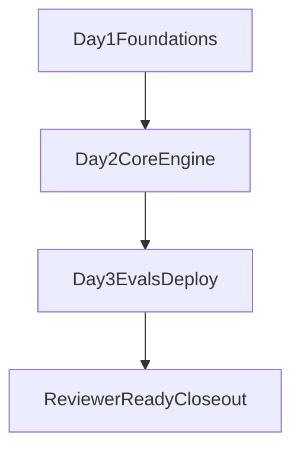

# Week Execution Overview

## Purpose

Provide a single runbook for the implementation week by linking daily checklists, phase gates, and completion criteria.

Use this as the top-level execution map; use day-level docs for task detail.

**Living status (done / next / blockers):** [`docs/PROGRESS.md`](./PROGRESS.md)

## Source Plan and Governance

- `docs/PRD.md`
- `docs/PRESEARCH.md`
- `docs/SOFTWARE_DESIGN_PRINCIPLES.md`
- `docs/REPOSITORY_HYGIENE.md`

## Daily Execution Docs

- Day 1: `docs/DAY1_EXECUTION_CHECKLIST.md`
- Day 2: `docs/DAY2_EXECUTION_CHECKLIST.md`
- Day 3: `docs/DAY3_EXECUTION_CHECKLIST.md`

## Weekly Objectives

1. Deliver a working distilled-first prototype with common-field checks.
2. Preserve clean architecture boundaries (deep modules, simple interfaces).
3. Collect measurable evidence for core technical claims (accuracy, latency, failover).
4. Deploy a stable evaluator-accessible Render URL.
5. Keep documentation aligned with actual implementation and trade-offs.

## Phase Alignment

### Phase 0 — Foundations and Contracts

- Thin vertical skeleton operational.
- Schema contracts and status semantics locked.
- Baseline tests and Docker flow running.

### Phase 1 — Core Engine

- Primary extraction provider wired.
- Deterministic validator behaviors implemented with tests.
- Failover orchestration behavior in place.

### Phase 2 — Integration and UX

- Fallback behavior integrated with route and UI.
- Result states and error paths visible and understandable.
- Manual-review and not-applicable semantics consistently surfaced.

### Phase 3 — Evals, Deployment, and Finalization

- Evals run and summarized.
- Fallback go/no-go decision documented.
- Render deployment verified with public URL.
- README/PRD/PRESEARCH consistency pass completed.

## Locked Decisions to Enforce During the Week

- Deployment target: Render-first, Fly/HF Docker fallback.
- Fallback OCR: Tesseract-first with explicit go/no-go thresholds and pivot policy.
- Vertical rollout: distilled first, wine second, beer third.
- Scope discipline: avoid overengineering, defer non-essential architecture.
- Quality discipline: commit only green states and keep history clean.

## Weekly Dependency Flow

## Daily Closeout Checklist

At the end of each day:

- touched tests pass,
- lint/type checks pass,
- docs are updated for any decision changes,
- next-day priorities are written down,
- repository state is clean and understandable.

## Final Reviewer-Ready Checklist

- Public URL works for upload and result review.
- Core field validation behavior is demonstrable.
- Failover behavior is demonstrable.
- Known limitations are clearly documented.
- Trade-offs are explicit and evidence-backed.

